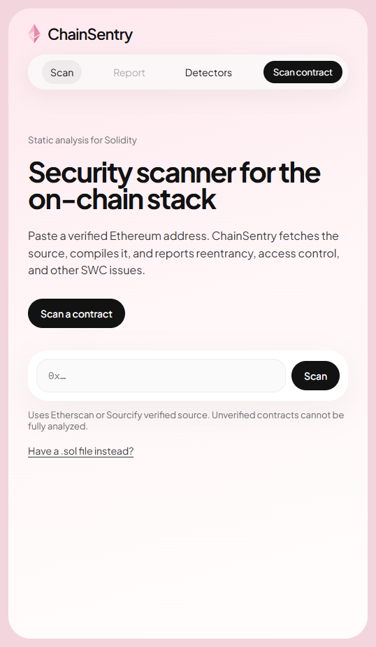

# ChainSentry

**Security scanner for the on-chain stack.** Paste a verified address on Ethereum, Base, or Arbitrum; ChainSentry fetches the source, compiles it with `solc`, and reports SWC-class issues with a severity mix, function attack surface, and on-chain context.

This is a defensive static analyzer. It reports findings and recommended fixes. It does not generate exploits, and it does not treat unverified bytecode as a full source audit.



## What it does

Address-first in the dashboard: enter `0x…`, get a report. You can still paste a `.sol` file or run the CLI against fixtures.

| Step | What happens |
|---|---|
| Source | Sourcify (no key), then Etherscan V2 if `ETHERSCAN_API_KEY` is set, then Blockscout. Proxies: one hop to the implementation. |
| Compile | Multi-file `solc` with the verified compiler version, optimizer / `viaIR` / runs from the explorer, Foundry remappings, `viaIR` retry on “stack too deep”. Library paths such as OpenZeppelin are skipped in analysis. |
| Detect | One detector module per vulnerability class, shared `Finding` model. Duplicate hits across files are collapsed. |
| Report | Verdict from severity mix (heuristic, not a 0–100 rating), plus per-function attack surface. |
| Report | Console, JSON, HTML, Markdown, SARIF, or the React dashboard (overview, findings, functions, on-chain snapshot). |

Unverified contracts stop with a clear error. Bytecode-only analysis is out of scope.

## Detectors

| ID | Issue | SWC |
|---|---|---|
| `SC-REENTRANCY-001` | Low-level or high-level external call before storage update | SWC-107 |
| `SC-ACCESS-001` | Privileged admin surface without access control | SWC-105 |
| `SC-TXORIGIN-001` | Auth via `tx.origin` | SWC-115 |
| `SC-UNCHECKED-001` | Low-level call with ignored return value | SWC-104 |
| `SC-DELEGATECALL-001` | `delegatecall` (worse if the target is a parameter) | SWC-112 |
| `SC-SELFDESTRUCT-001` | `selfdestruct` | SWC-106 |
| `SC-TIMESTAMP-001` | Protocol time gate on `block.timestamp` (not swap deadlines) | SWC-116 |
| `SC-RANDOMNESS-001` | RNG from block attributes | SWC-120 |
| `SC-ERC20-001` | Ignored ERC-20 `transfer` / `transferFrom` / `approve` return | ERC20 |
| `SC-INIT-001` | Public `initialize()` with no initializer guard | initializer |
| `SC-TRANSFERFROM-001` | `transferFrom` `from` is a caller-controlled argument | arbitrary-from |

Each detector lives under `src/scanner/detectors/`. The CLI, FastAPI, and dashboard consume the same findings.

Heuristic scanners still miss issues and can false-positive. Treat findings as a triage signal, not an audit sign-off.

## Quick start (dashboard)

Python 3.10+ (3.12 in CI). `py-solc-x` downloads `solc` on first compile.

```bash
python -m venv .venv
# Windows: .venv\Scripts\activate
# macOS/Linux: source .venv/bin/activate
pip install -r requirements.txt
pip install -e .
```

API (from the repo root):

```bash
# Windows
set PYTHONPATH=src
uvicorn api.main:app --app-dir src --host 127.0.0.1 --port 8000

# macOS/Linux
PYTHONPATH=src uvicorn api.main:app --app-dir src --host 127.0.0.1 --port 8000
```

UI:

```bash
cd frontend
npm install
npm run dev
```

Open [http://localhost:5173](http://localhost:5173). Vite proxies `/api` to the process on port 8000.

A finished report lives at `#/report/<id>` and is stored in SQLite (`data/scans.sqlite`) so refresh and copy-link work after the API restarts.

Try a Sourcify-verified mainnet address (no Etherscan key):

`0x7a250d5630B4cF539739dF2C5dAcb4c659F2488D` – Uniswap V2 Router

Contracts that exist only on Etherscan need `ETHERSCAN_API_KEY` in `.env` and a restarted API process.

## CLI

```bash
python -m scanner scan contracts/example.sol
python -m scanner scan contracts/vulnerable/Reentrancy.sol --format all
python -m scanner scan contracts/safe/SafeReentrancy.sol --fail-on high

python -m scanner scan --address 0x7a250d5630B4cF539739dF2C5dAcb4c659F2488D
python -m scanner scan --chain-id 8453 --address 0x...
python -m scanner scan contracts/example.sol --format json --output reports
python -m scanner scan contracts/example.sol --format html
python -m scanner scan contracts/vulnerable/Reentrancy.sol --format markdown
python -m scanner scan contracts/vulnerable/Reentrancy.sol --format sarif
```

`--fail-on high` exits `1` if high or critical findings exist (used in CI). Unverified or unsupported compilers exit `3`.

## API

- `POST /scan` – `{ "address": "0x...", "chain_id": 1 }` (`8453` Base, `42161` Arbitrum) or `{ "source": "pragma ..." }`
- `GET /scan/{id}` – stored result
- `GET /scan/{id}/report.md` – Markdown report
- `GET /scan/{id}/report.sarif` – SARIF 2.1.0
- `GET /contract/{address}?chain_id=1` – verification + on-chain signals
- `GET /health`

## Configuration

Copy `.env.example` to `.env` (gitignored):

| Variable | Role |
|---|---|
| `ETHERSCAN_API_KEY` | Etherscan V2 fallback + tx stats. Optional if Sourcify has the source. |
| `ETHERSCAN_CHAIN_ID` | CLI default when `--chain-id` is omitted. UI sends `chain_id` per scan (`1` / `8453` / `42161`). |
| `ETH_RPC_URL` | Ethereum RPC for balance, EIP-1967 slots, `owner()`. |
| `BASE_RPC_URL` | Base RPC (default `https://mainnet.base.org`). |
| `ARB_RPC_URL` | Arbitrum One RPC (default `https://arb1.arbitrum.io/rpc`). |

Local `.sol` scans never need a key.

## Tests and CI

Fixtures in `contracts/vulnerable/` must produce the matching finding. Fixtures in `contracts/safe/` must not false-positive at high severity.

```bash
pytest
```

GitHub Actions (`.github/workflows/security.yml`) runs pytest, gates on safe contracts with `--fail-on high`, and uploads HTML/JSON/Markdown/SARIF reports.

## Docker

Requires Docker Desktop (or another Compose-capable engine). From the repo root:

```bash
docker compose up --build
```

- UI: http://localhost:3000
- API: http://localhost:8000/health

The UI proxies `/api` to the API container. Stop a local uvicorn on port 8000 first if that port is already in use.

## Railway

One service serves the UI and API from the root `Dockerfile`. From the repo root, after `railway login`:

```bash
railway init
railway up
```

In the Railway dashboard: set the service to **at least 1 GB RAM**, attach a volume at `/app/data`, and generate a public domain. Leave `ETHERSCAN_API_KEY` unset for a Sourcify-only public demo. Optional: `CORS_ORIGINS` (comma-separated) if the UI is hosted on a different origin.

## Layout

```
src/scanner/          engine, compiler, parser, detectors, scoring, reports, CLI
src/api/              FastAPI
frontend/             React + TypeScript dashboard
contracts/            example + vulnerable / safe fixtures
tests/                compiler, parser, detectors, API
.github/workflows/    pytest + scan gate
```

## License

MIT
